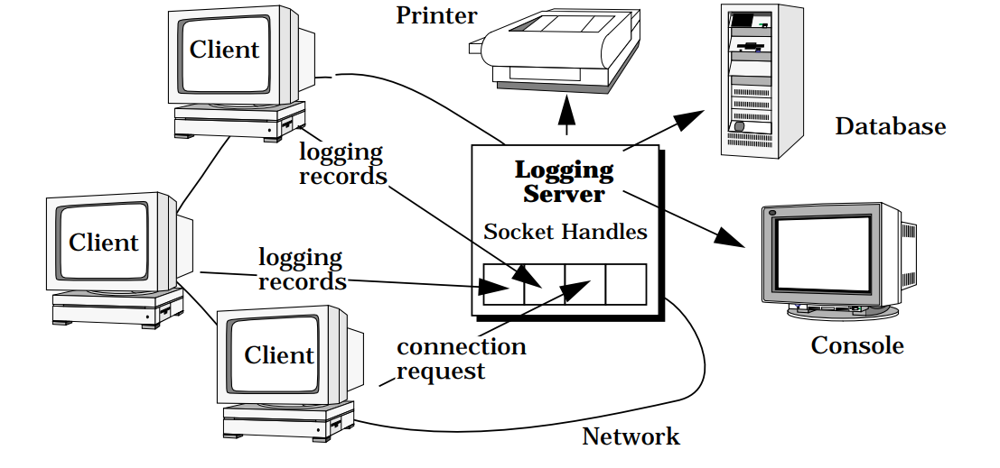

# Reactor 论文翻译

```text
The Reactor design pattern handles service requests that are delivered concurrently to an application by one or more clients.
```

Reactor 设计模式处理由一个或多个客户端同时传送到应用程序的服务请求。

## 例子

考虑用于分布式日志记录服务的事件驱动服务器。客户端使用日志记录服务来记录它们在分布式环境中的状态信息。此状态信息通常包括错误通知、调试跟踪和性能诊断。日志记录被发送到中央日志服务器，该服务器可以将记录写入各种输出设备，例如控制台、打印机、文件或网络管理数据库。具体布局如图所示：



客户端使用面向连接的协议与日志服务器进行通信，例如 TCP [Ste90]：客户端和日志服务绑定到由客户端和日志服务器上的 IP 地址和 TCP 端口号指定的连接。日志服务通常由多个客户端使用，每个客户端都维护自己与日志服务器的连接。因此这些客户端发出的日志记录和连接请求可以同时到达日志服务器。

日志服务器可以使用多线程，以 “thread-per-connection” 的方式来实现记录日志。然而，无法解决以下问题：

- 效率。 由于上下文切换、同步和数据移动[Sch94], 可能会导致性能不佳。
- 编程简单。 线程可能需要复杂的并发控制方案。
- 便携性。 线程并非在所有操作系统平台上都可用。

由于这些缺点，多线程通常既不是开发并发日志服务器的最有效且最不复杂的解决方案。 然而我们必须同时处理客户端请求。

## 背景

```text
A server application in a distributed system that receives service requests from one or more clients concurrently.
```

翻译成中文就是，在分布式系统中，一个服务器应用程序接收并处理来自一个或多个客户端同时发出的请求。

## 问题

在分布式系统中，一个服务器应用程序接收并处理来自一个或多个客户端同时发出的请求。

每个这样的请求通常与特定的操作系统事件相关联。 例如，在我们的日志服务器示例中，处理日志服务中的日志记录请求由 READ 事件指示。 因此，在调用特定服务之前，服务器应用程序必须解复用并将每个传入事件分派给其相应的服务提供者。 有效解决这一问题需要解决以下五点：

1. 服务器必须能够处理输入事件，即使它是等待其他事件发生。 特别是，服务器不得无限期地阻塞处理任何单一事件源，因为这可能会显著延迟对其他客户的响应能力；
2. 服务器必须最小化延迟、最大化吞吐量并避免不必要地使用 CPU。
3. 服务器的设计应该简化并发策略的使用。
4. 集成新的或改进的服务，例如更改消息格式或添加服务器端缓存，应该会产生最小的影响现有代码的修改和维护成本。 例如，为了实现应用程序服务不需要修改通用事件多路分解和分派机制。
5. 将服务器移植到新的操作系统平台不应该需要付出巨大的努力。

## 解决方案

将事件的同步多路解复用与将事件分派到处理这些事件的服务提供者集成在一起。 此外，将这些通用事件多路解复用和分派机制，与特定于应用程序的事件分派到服务提供者内的服务分离。

对于应用程序提供的每项服务，引入一个单独的事件处理程序来处理某些类型的事件。 事件处理程序向 initiation dispatcher 注册，该 initiation dispatcher 使用synchronous event demultiplexer 来等待事件发生。 当事件发生时，synchronous event demultiplexer 通知 initiation dispatcher，该 initiation dispatcher 同步回调与该事件关联的事件处理程序。 然后，事件处理程序将事件分派给实现所请求服务的方法。

## 架构

Reactor 模式主要包括以下参与者：

- 句柄(Handle)。 句柄标识由操作系统管理的资源。 这些资源通常包括网络连接、打开的文件、计时器和同步对象等。日志服务器中使用句柄来识别套接字端点，以便同步事件多路分解器可以等待它们上发生的事件。 日志服务器感兴趣的两种类型的事件是连接事件和读取事件，它们分别表示传入的客户端连接和日志数据。 日志服务器为每个客户端维护一个单独的连接。 每个连接在服务器中都由一个套接字句柄表示。
- 同步事件多路分解器(synchronous event demultiplexer )。它会阻止等待一组句柄上发生的事件。 阻塞不会妨碍同步事件多路分解器所在的进程的进度，因为它仅在没有事件在句柄处排队时才会阻塞。 当可以在句柄上启动操作而不会阻塞时，它会返回。 I/O 事件的常见多路分解器是 select [Ste90]，它是 UNIX 和 Win32 操作系统平台提供的事件多路分解系统调用。 select 调用指示哪些句柄可以在不阻塞的情况下同步调用它们上的操作。
- 分发器(initiation dispatcher)。它定义了用于注册、删除和调度事件处理程序对象的接口。 最终，同步事件多路分解器负责等待事件发生。 当它检测到新事件时，它会通知分发器回调特定于应用程序的事件处理程序。 常见事件包括连接接受事件、数据输入输出事件、超时事件。
- 事件处理器（Event Handler）。它指定一个由钩子方法 [Pree95] 组成的接口，该方法抽象地表示特定于服务的事件的分发操作。具体事件处理器派生自抽象事件处理器。 每个都实现应用程序提供的特定服务的方法。 此外，具体的事件处理器实现了继承的事件分发钩子方法，该方法负责处理从客户端发送到服务的传入事件。应用程序向分发器注册具体的事件处理器以处理某些类型的事件。 当这些事件到达时，分发器回调相应的具体事件处理器的钩子方法。日志服务器中有两个具体的事件处理程序：日志处理器和日志接受器。 日志处理器负责接收和处理日志记录。 日志记录接受器使用接受-连接模式 (129) 创建和连接日志记录处理器，以处理来自客户端的后续日志记录。

Reactor 模式中参与者的结构如下面的 UML 类图所示：


## 实现流程

Reactor 模式中发生以下协作：

- 应用程序向分发器注册具体的事件处理器。应用程序指示该事件处理器希望分发器通知它关联句柄上何时发生事件的事件类型。
- 分发器请求每个事件处理器传回其内部句柄。 该句柄向操作系统标识事件处理器。
- 注册所有事件处理器后，主程序调用handle_events()来启动分发器的事件循环。 此时，启动调度程序组合来自每个已注册事件处理程序的句柄，并使用同步事件多路分解器等待这些句柄上发生事件。 例如，TCP 协议层使用 select 同步事件多路分解操作来等待客户端日志记录事件到达连接的套接字句柄。
- 当与事件源对应的句柄变为“就绪”时，同步事件多路分解器通知分发器，例如，TCP套接字“准备好读取”。
- 分发器回调事件处理器钩子方法以响应就绪句柄上的事件。 当事件发生时，分发器使用事件源句柄作为“键”来定位和调度适当的事件处理器的钩子方法。 发生的事件类型可以作为参数传递给该方法，并由该方法在内部使用来执行其他特定于服务的多路分解和分派。

具体流程如图所示：


## 参考

[1] [Reactor](http://www.laputan.org/pub/sag/reactor.pdf)
