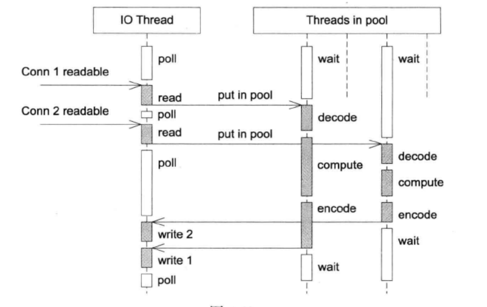
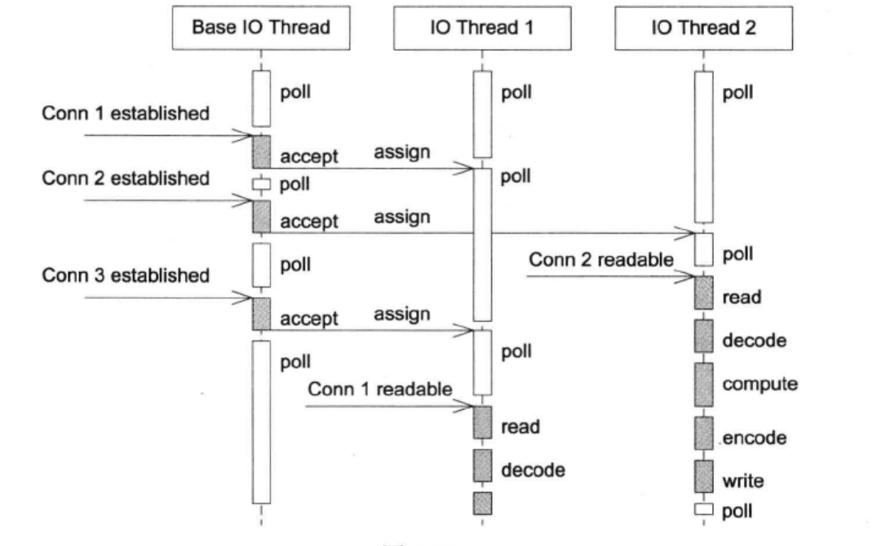

# TCP 网络编程基础

## TCP 网络编程本质论

基于事件的非阻塞网络编程是编写高性能并发网络服务程序的主流模式，它改变了以往的编程思维模式。主要改变如下：

1. 主动调用`recv(2)`来接收数据 -> 注册一个接收数据的回调，网络库收到数据会调用我，直接把数据提供给我，供我消费；
2. 主动调用`accept(2)`来接受新连接 -> 注册一个接受新连接的回调，网络库接受了新连接会回调我，直接把新的新连接对象传递给我，供我使用；
3. 主动调用`send(2)`来发送数据 -> 需要发送数据时，只管往连接里写，网络库会负责无阻塞地发送。

我们认为，TCP 网络编程最本质的是处理‘三个半’事件：

1. 连接的建立，包括服务端接受(accept)新连接和客户端发起(connect)连接。TCP连接一旦建立，客户端和服务端是平等的，可以各自收发数据；
2. 连接的断开，包括主动断开(close、shutdown)和被动断开(read(2)返回0)；
3. 消息到达，文件描述符可读。这是一个最为重要的一个事件，对它的处理方式决定了网络编程的风格(阻塞还是非阻塞，如何处理分包，应用层的缓冲设计，等等)；
4. 消息发送完毕，还算半个。对于低流量的服务，可以不必关心这个事件；另外，这里“发送完毕”是指将数据写到操作系统的缓冲区，将由TCP协议栈负责数据的发送与重传，不代表对方已经收到数据。

这其中有很多难点，也有许多细节需要考虑，比如说：

1. 如果要主动关闭连接，如何保证对方已经收到全部数据？如果应用层有缓冲，那么需要保证先发送完缓冲区中的数据，然后再断开连接；
2. 如果主动发起连接，但是对方拒绝，如何定期重试？
3. 非阻塞网络编程应用边沿触发(edge trigger)还是电平触发(level trigger)？如果采用电平触发，那么什么时候关注 EPOLLOUT 事件？会不会造成 busy-loop ? 如果是边沿触发，如何防止漏读造成的饥饿？epoll(4) 一定比 poll(2) 快吗？
4. 在非阻塞网络编程中，为什么要使用应用层发送缓冲区？
5. 在非阻塞网络编程中，为什么要使用应用层接收缓冲区？
6. 在非阻塞网络编程中，如何设计并使用缓冲区？
7. 如果使用发送缓冲区，万一接收方处理缓慢，数据会不会一直堆积在发送方，造成内存暴涨？如何做应用层的流量控制？

## 常见的并发网络服务程序设计方案

### 方案0

一次只能服务一个客户，直至断开该客户断开连接，才能处理下一个客户。因此采用该方案的服务器端也成为迭代式服务器。此方案不适合长连接，适合类似于 daytime 这种 write-only 短连接服务。

### 方案1

也被称为`process-per-connection`。主线程接收一个新连接，然后会调用`fork()`创建一个新的进程来专门用于处理该连接上的所有请求。此方案适合“计算响应的工作量大于`fork()`的开销”的情形，比如数据库服务器。但受限于系统支持的进程数。

### 方案2

与方案1基本一致，不过用线程取代了进程而已。相比于进程，线程的创建、切换和销毁开销均较小。同样受限于系统支持的线程数。

### 方案3

方案1的改进，在一定程度上，可以减少进程创建和销毁的开销。

### 方案4

方案2的改进，在一定程度上，可以减少线程创建和销毁的开销。

### 方案5

也称单线程 Reactor方案。具有以下优点：

- 采用 I/O 复用技术，能够在单个线程并发处理多个客户端连接；
- 解耦了网络数据收发和业务逻辑代码，由网络库搞定数据分支，程序只关心业务逻辑；
  
但是，它采用单线程的方案，也就是说网络 IO 数据收发和具体的任务处理(比如编解码)均在一个线程。所以它比较适合处理 IO 密集型的应用，不太适合 CPU 密集的应用，因为无法发挥多核的优势。如下执行流程如下左图所示。

至于上图的右侧，反映了在下一次调用`poll()`之前新发生的所有事件，只能在下一个`poll()`调用之后进行处理。

### 方案6

方案5的改进版，reactor + thread-per-task。它在收到具体的请求之后，创建一个新线程去计算，这样就 reactor 线程就能够处理后续的请求，充分利用多核的优势。

### 方案7

无意义，不做讨论。

### 方案8

可以看作是方案6的改进版，reactor + thread pool。由一个线程池来处理具体的请求，这样可以避免线程频繁创建和销毁的开销。这种方案也是现有网络库常用的方案。

### 方案9

这是 muduo 内置的多线程方案，也是 Netty 内置的多线程方案。这种方案的特点是 one loop per thread, 有一个 main Reactor 负责 accept(2) 连接，然后把连接挂在某个 sub Reactor 中, 这样该连接的所有操作都在那个 sub Reactor 所处的线程中完成。以下该方案的执行流程示意图。

muduo 采用的是固定大小的 reactor pool, 池子的大小通常根据 cpu 数确定，为了保证每个核都能够跑满，池的大小应略大于 cpu 数。因为有些 reactor 线程可能比较空闲，它对应的 cpu 就不能跑满。但是对于单个计算型的请求，却仅能在一个线程内进行处理。

### 方案 10

与方案9基本一致，不过是多线程可以为多进程。

### 方案 11

方案 8 和方案 9的结合。既使用多个 reactor 来处理 IO，又使用线程池来处理计算。这种方案适合既有突发 IO（利用多线程来处理连接上的IO），又有突发计算的应用（利用线程池把一个连接上的计算任务分配给多个线程去做）。

一个程序到底是使用一个 event loop 还是使用多个 event loops 呢？ ZeroMQ 的手册给出的建议是，按照每千兆比特每秒的吞吐量配一个 event loop的比例来设置 event loop的数目。比如程序运行在千兆以太网上，那么设置一个 event loop 就好。如果程序本身没有多少计算量，主要瓶颈在网络带宽，只用一个 event loop就可以满足需求。如果程序的IO带宽较小，计算量较大，那么可以把计算放到 thread pool 中。

### 总结

推荐采用方案 11, 理由是灵活，可根据具体场景自由切换到方案5、方案8、方案9。

## 参考

[1] Linux 多线程服务器编程：使用 muduo C++ 网络库
